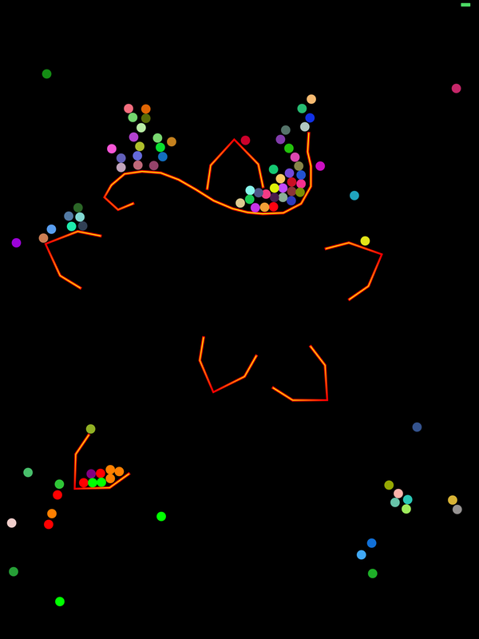

# Marbles
iPad demonstrates DynamicAnimator effects

UIDynamicItemBehavior class makes it easy to add\
Gravity and Collision detection to your objects.

This sill app shows them in action.
Note: create you own barrier with screen touches.

